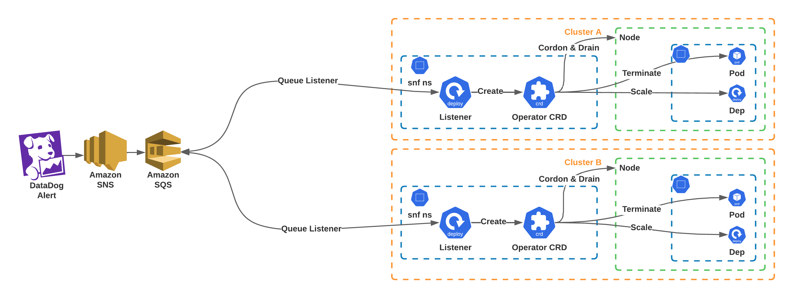

# sniff-n-fix:

## sniff-n-fix is a event driven k8s cluster auto-healing solution (WIP)

Written primarily in Go utilizing go-client, snf (sniff-n-fix) is composed to three main moving parts:

- **DataDog** : Creates a messages to the SQS queue for the events to trigger (Can be substituted with any other observability solution)
- **EventListener** : Listens the SQS for messages, fulfilled by the Datadog Monitors (Can be subtituted with any other observability solutions)
- **Operator CRD** : Which works to enable and apply the actions based on the Action Objects sent by the **EventListener** Deployment

### Synopsis:

DataDog sends a payload with specific fields to a webhook/api endpoint to create am entry in the SQS Queue, the Listener Deployment, when found with an entry, parses it, and sends in a custom Listener Object to the *then* created CRD (Operator). Depending on the **actionType** specific actions are triggered by the CRD, post successful execution, the message from the SQS queue is removed, thereby ending the process.

### HLD: ###

